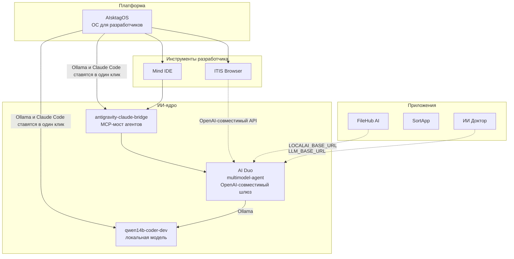

# MindTagSystem

**MindTagSystem** — экосистема программ, которую создаёт **Тагир Искалиев** ([@tagiriskaliev18-hash](https://github.com/tagiriskaliev18-hash)). Своя операционная система, свой браузер, своя IDE, своё ИИ-ядро и приложения поверх них, собранные так, чтобы работать вместе.

> **Философия.** Сделать максимально комфортную систему для программистов, которую можно встроить в любое устройство и сразу начать работать. Сегодня это компьютеры и ноутбуки, дальше планшеты и телефоны.

Это главный репозиторий экосистемы. Кода здесь нет: здесь карта, правила и описание того, как всё устроено. Сами проекты живут в своих репозиториях, и каждый из них ссылается сюда.

## Проекты

| Слой | Проект | Что делает | Статус |
|---|---|---|---|
| Платформа | **[AIsktagOS](https://github.com/tagiriskaliev18-hash/AisktagOS)** | Операционная система для разработчиков в стиле macOS на базе Ubuntu 26.04 LTS. Любое x86-64 железо и любая видеокарта, инструменты программиста из коробки | 1.0, ISO в Releases |
| Инструменты | **[Mind IDE](https://github.com/tagiriskaliev18-hash/Mind-IDE)** | Собственная среда разработки, центральное рабочее место программиста | репозиторий создаётся |
| Инструменты | **[ITIS Browser](https://github.com/tagiriskaliev18-hash/ITIS-browser)** | Браузер на Chromium с ИИ-агентом, который читает страницу и сам кликает и прокручивает её | прототип |
| ИИ-ядро | **[AI Duo / multimodel-agent](https://github.com/tagiriskaliev18-hash/multimodel-agent)** | Единый ИИ-шлюз с OpenAI-совместимым API поверх OpenAI, Hermes, Groq, Ollama и Pollinations | работает, Docker |
| ИИ-ядро | **[antigravity-claude-bridge](https://github.com/tagiriskaliev18-hash/antigravity-claude-bridge)** | MCP-мост между Antigravity (Gemini), Claude Code и пулом внешних моделей | используется ежедневно |
| ИИ-ядро | **[qwen14b-coder-dev](https://github.com/tagiriskaliev18-hash/qwen14b-coder-dev)** | Локальная офлайн-модель для программирования (Qwen 2.5 Coder 14B в Ollama) с веб-чатом | работает |
| Приложения | **[FileHub AI](https://github.com/tagiriskaliev18-hash/filehub-ai)** | Хранилище файлов с ИИ-агентом, который правит Word, PowerPoint и Excel по тексту, плюс сжатие и конвертация | MVP |
| Приложения | **[SortApp](https://github.com/tagiriskaliev18-hash/sortapp)** | Анализатор журналов доступа к сетевым папкам Synology с отчётами Excel (закрытый репозиторий) | в работе |
| Приложения | **[ИИ Доктор](https://github.com/tagiriskaliev18-hash/medical-ai-assistant)** | Офлайн-ассистент врача приёмного покоя: калькуляторы, анализы, лекарства, протоколы SOAP | работает |

Подробно о каждом проекте: [docs/PROJECTS.md](docs/PROJECTS.md). Машиночитаемый реестр: [ecosystem.json](ecosystem.json).

## Как устроена экосистема

Четыре слоя, снизу вверх:

1. **Платформа.** AIsktagOS даёт стабильную основу: одна и та же среда на любом компьютере, всё для разработки уже стоит.
2. **Инструменты разработчика.** Mind IDE и ITIS Browser: где программист пишет код и работает с вебом.
3. **ИИ-ядро.** Модели и маршрутизация. Локальная модель работает без интернета, шлюз объединяет облачные и локальные модели за одним API, мост позволяет нескольким агентам работать над одной задачей.
4. **Приложения.** Готовые продукты для людей и компаний, которые используют ИИ-ядро.

Сплошные стрелки на схеме работают уже сейчас. Пунктирные показывают подключение, которое уже возможно через настройки, но пока не включено по умолчанию. Подробности, точки интеграции и план: [docs/ARCHITECTURE.md](docs/ARCHITECTURE.md).

## Принципы

- **Программист на первом месте.** Каждое решение проверяется вопросом: стало ли удобнее тому, кто пишет код?
- **Работает везде.** Любое железо, любая видеокарта, офлайн-режим там, где это возможно.
- **ИИ встроен, а не прикручен.** Модели доступны через один общий интерфейс, и любой проект экосистемы может ими пользоваться.
- **Без привязки к одному поставщику.** Облачные модели, локальные модели и бесплатные шлюзы взаимозаменяемы.
- **Каждый проект самостоятелен.** Его можно поставить и использовать отдельно, а вместе с остальными он даёт больше.

## Дорожная карта

Коротко: подключить все приложения к общему ИИ-шлюзу, встроить Mind IDE и ITIS Browser в AIsktagOS, затем перенести систему на ARM, планшеты и телефоны. Полный план: [docs/ROADMAP.md](docs/ROADMAP.md).

## Для участников и ИИ-агентов

Правила экосистемы, шаблон раздела для README и порядок добавления нового проекта: [docs/CONVENTIONS.md](docs/CONVENTIONS.md).

## Автор

**Тагир Искалиев** — автор и создатель MindTagSystem и всех проектов экосистемы.
GitHub: [@tagiriskaliev18-hash](https://github.com/tagiriskaliev18-hash)
