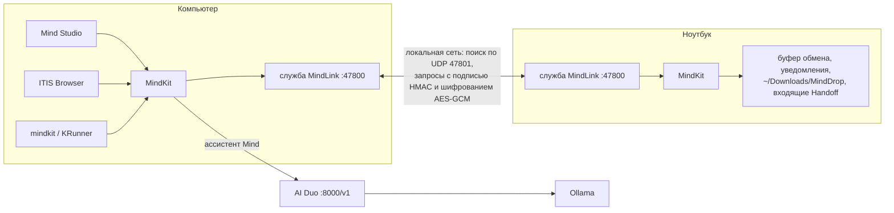

# Фишки Apple в MindTagSystem

Apple сильна не отдельными программами, а тем, что её устройства и программы работают как одно целое. Здесь собраны фишки экосистемы Apple, которые MindTagSystem может повторить на своих проектах, и где каждая из них живёт.

Большая часть общих служб собрана в **[MindKit](MINDKIT.md)** — небольшой библиотеке и команде `mindkit` в этом репозитории. Это аналог системных фреймворков Apple: каждый проект экосистемы подключает их одной строкой, а не пишет своё.

## Уже работает

| У Apple | В MindTagSystem | Где | Как попробовать |
|---|---|---|---|
| **Связка ключей (Keychain)** | Связка ключей Mind: ключ API вводится один раз и виден всем проектам | MindKit; Mind IDE, AI Duo, Центр AIsktagOS | `mindkit keychain set GROQ_API_KEY`, `mindkit keychain import .env` |
| **Apple ID для устройств** | Аккаунт MindLink: один ключ на все свои устройства, чужие устройства не видят ваши | MindKit | `mindkit link init` на первом, `mindkit link join КЛЮЧ` на остальных |
| **Универсальный буфер обмена** | Скопировали на ноутбуке — вставили на компьютере | служба MindLink | `mindkit link daemon` (в AIsktagOS запущена сама), `mindkit copy текст` |
| **Handoff** | Вкладка браузера, файл со строкой или разговор с ИИ продолжаются на другом устройстве | MindKit, ITIS Browser (кнопка ⇄), Mind Studio (кнопка в шапке) | `mindkit handoff url https://…`, `mindkit handoff resume` |
| **AirDrop** | MindDrop: файлы на свои устройства в локальной сети, с шифрованием | MindKit, Центр AIsktagOS | `mindkit drop отчёт.pdf --to Ноутбук` |
| **Центр уведомлений** | Одна история уведомлений, уведомления на все устройства сразу | MindKit | `mindkit notify "Сборка" "ISO готов" --devices` |
| **Spotlight** | Mind Search: приложения экосистемы, быстрые команды, Handoff, настройки и файлы проектов в одном поиске | MindKit, KRunner в AIsktagOS (Meta+Space) | `mindkit search router --content` |
| **Siri** | Ассистент Mind из любой программы и терминала | MindKit → шлюз AI Duo → Ollama | `mindkit ask "как откатить коммит?"`, `git diff \| mindkit ask "найди ошибки"` |
| **Команды (Shortcuts)** | Быстрые команды: цепочки шагов в JSON (буфер, ИИ, уведомления, Handoff, команды оболочки) | MindKit | `mindkit shortcuts run "Объяснить код"` |
| **App Store** | Mind Store: каталог приложений экосистемы из `ecosystem.json`, установка и обновление в один клик | MindKit, Центр AIsktagOS, Mind Search | `mindkit store list`, `mindkit store install itis-browser` |
| **Human Interface Guidelines** | Дизайн Aurora: одни токены, иконки Mind, переливающийся градиент, 3D и bounce для веба и Qt ([DESIGN.md](DESIGN.md)) | MindKit (`mindkit/data/tokens.json`) | `mindkit design build`, `mindkit.qtfx` |
| **Настройки iCloud** | Единый файл настроек экосистемы вместо `.env` в каждом проекте | MindKit | `mindkit config set gateway.url http://127.0.0.1:8000/v1` |
| **Time Machine** | Снимки Btrfs + Timeshift перед каждым обновлением | AIsktagOS | уже в системе |
| **Xcode** | Mind IDE: своя среда разработки с ИИ | Mind IDE | — |
| **Safari** | ITIS Browser со встроенным ИИ-агентом | ITIS Browser | — |

## Как это устроено

Безопасность устроена как у Apple ID: устройства с одним ключом аккаунта доверяют друг другу, остальные их не видят. Каждый запрос и каждый ответ подписан, повтор старого запроса отклоняется, содержимое шифруется AES-GCM (если установлен пакет `cryptography`; в AIsktagOS он есть). Брандмауэр AIsktagOS открывает порты MindLink только для локальной сети.

## Следующие шаги

| У Apple | Что сделать в MindTagSystem | Где |
|---|---|---|
| **iCloud Drive** | Синхронизация папки `~/MindTagSystem/Sync` между своими устройствами поверх MindLink (без облака) | MindKit |
| **Локатор (Find My)** | Последнее место и время, когда устройство было в сети, удалённая блокировка экрана | MindKit + AIsktagOS |
| **Universal Control / Sidecar** | Одна мышь и клавиатура на два компьютера, планшет как второй экран (на основе Input Leap / KDE Connect) | AIsktagOS |
| **Continuity Camera** | Камера телефона как веб-камера компьютера | мобильная версия (этап 4) |
| **Виджеты** | Виджеты Plasma для MindLink (устройства рядом), Mind Store и истории уведомлений | AIsktagOS |
| **Фокусирование** | Режим «Работа» отключает уведомления и сайты-отвлекатели одновременно в ОС и ITIS Browser | MindKit + ITIS Browser |
| **Вход с Apple / ключи доступа** | Единый вход во все веб-приложения экосистемы (FileHub AI, SortApp) по аккаунту Mind | FileHub AI, SortApp |
| **TestFlight** | Канал бета-версий в Mind Store: ветка `beta` у каждого проекта | MindKit, ecosystem.json |
| **Нотаризация приложений** | Подпись релизов ключом автора и проверка подписи в Mind Store | MindKit |
| **Семейный доступ** | Несколько аккаунтов MindLink на одном устройстве (работа и дом) | MindKit |

## Что не берём

Apple Pay, iMessage и собственные чипы требуют своих серверов, договоров с банками и операторами или своего железа. Это противоречит идее MindTagSystem работать на любом устройстве без облака, поэтому в планах этого нет.
