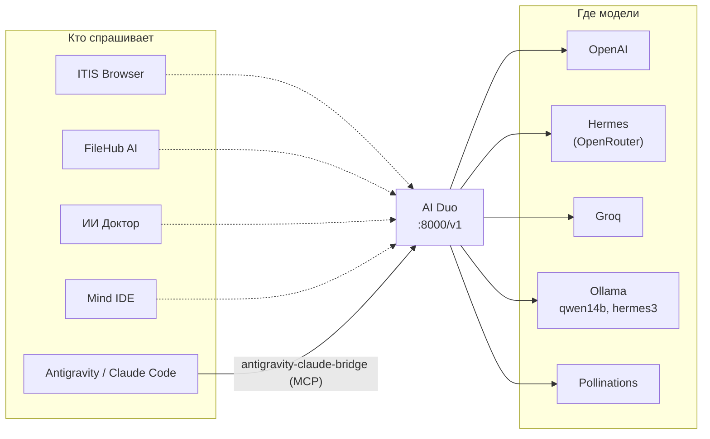

# Архитектура MindTagSystem

## Идея

Экосистема построена как у Apple: одна платформа, свои инструменты и свои приложения, которые знают друг о друге. Разница в том, что MindTagSystem делается для программистов и не привязана к своему железу: её можно поставить на любой компьютер, а дальше на планшеты и телефоны.

Каждый проект остаётся отдельным репозиторием и работает сам по себе. Связывают их четыре вещи:

1. **Общая платформа** — AIsktagOS, где всё ставится и работает одинаково.
2. **Общее ИИ-ядро** — модели доступны через один OpenAI-совместимый интерфейс.
3. **Общие службы MindKit** — связка ключей, MindLink между устройствами, поиск, быстрые команды, Mind Store и дизайн Aurora ([MINDKIT.md](MINDKIT.md), [APPLE.md](APPLE.md)).
4. **Общие правила** — этот репозиторий, реестр [`ecosystem.json`](../ecosystem.json) и раздел «Часть экосистемы MindTagSystem» в README каждого проекта.

## Слои

```
┌──────────────────────────────────────────────────────────────────┐
│  Приложения       FileHub AI · SortApp · ИИ Доктор                │
├──────────────────────────────────────────────────────────────────┤
│  ИИ-ядро          AI Duo (шлюз) · bridge (MCP) · Qwen 14B (локально)│
├──────────────────────────────────────────────────────────────────┤
│  Инструменты      Mind IDE · ITIS Browser                         │
├──────────────────────────────────────────────────────────────────┤
│  Платформа        AIsktagOS (Ubuntu LTS + KDE Plasma)             │
└──────────────────────────────────────────────────────────────────┘
```

## ИИ-ядро: как модели попадают в проекты

Центр ИИ-ядра — шлюз **AI Duo** из [multimodel-agent](https://github.com/tagiriskaliev18-hash/multimodel-agent). Он отвечает на `POST /v1/chat/completions` в формате OpenAI и сам выбирает провайдера: OpenAI, Hermes, Groq, Ollama или бесплатный Pollinations.



### Как подключить проект к шлюзу уже сейчас

Запустите шлюз (`docker compose up -d` в multimodel-agent) и укажите его адрес в настройках проекта:

| Проект | Настройка | Значение |
|---|---|---|
| FileHub AI | `LOCALAI_BASE_URL`, `LOCALAI_MODEL` в `apps/api/.env` | `http://localhost:8000` и, например, `gpt-4o-mini` |
| ИИ Доктор | `LLM_BASE_URL`, `LLM_MODEL` в `backend/.env` | `http://localhost:8000/v1` и модель шлюза |
| qwen14b-coder-dev | в обратную сторону: шлюз видит модель через Ollama | `OLLAMA_BASE_URL=http://127.0.0.1:11434/v1` в шлюзе |
| ITIS Browser | адрес и ключ сейчас заданы в `main.py` | вынести в настройки и указать шлюз (в плане) |

### Маршрутизатор Mind

У [Mind IDE](https://github.com/tagiriskaliev18-hash/Mind-IDE) свой маршрутизатор моделей `aisktag_ai.py`: режим «Авто», переключение при сбоях, консилиум и кэш, провайдеры от локальной llama.cpp до Claude. Сейчас он работает напрямую с провайдерами, параллельно шлюзу AI Duo; объединить их каталоги моделей и ключей — задача этапа 2 дорожной карты.

### Мост агентов

[antigravity-claude-bridge](https://github.com/tagiriskaliev18-hash/antigravity-claude-bridge) — это слой для разработки самой экосистемы. Antigravity (Gemini) планирует и делит задачу, Claude Code делает ревью и реализацию, дешёвые модели из пула пишут черновики. Расширенная версия того же `claude_bridge.py` лежит в `multimodel-agent/tools`: там к нему добавлены реестры агентов, навыков и моделей шлюза.

## Службы MindKit: что связывает проекты

MindKit (`mindkit/` в этом репозитории) — общая библиотека на чистом Python и команда `mindkit`. Проекты подключают её необязательным импортом: есть MindKit — появляются функции экосистемы, нет — проект работает как раньше.

| Служба | Кто пользуется |
|---|---|
| Связка ключей `mindkit.keychain` | Mind IDE (`aisktag_ai.py`), AI Duo (`server/app/config.py`), Центр AIsktagOS |
| MindLink `mindkit.link`: буфер, Handoff, MindDrop, уведомления | ITIS Browser (кнопка ⇄), Mind Studio (Handoff разговоров), служба `mindlink.service` и Центр AIsktagOS |
| Ассистент `mindkit.assistant` → AI Duo → Ollama | ITIS Browser (запасной путь), быстрые команды, `mindkit ask` |
| Поиск `mindkit.search` | KRunner AIsktagOS (D-Bus-плагин `mindkit-krunner.py`), `mindkit search` |
| Mind Store `mindkit.store` по `ecosystem.json` | Центр AIsktagOS, Mind Search |
| Дизайн Aurora `mindkit.design` | токены общие с Mind IDE |

В AIsktagOS копия MindKit лежит в `overlay/usr/lib/python3/dist-packages/mindkit` и обновляется скриптом `tools/sync-mindkit.sh`.

## Платформа: что даёт AIsktagOS

- Одна и та же среда на любом x86-64 компьютере с любой видеокартой.
- Инструменты программиста из коробки и «Центр AIsktagOS», который ставит в один клик **Ollama** (для qwen14b-coder-dev и шлюза) и **Claude Code** (для моста агентов).
- Снимки Btrfs перед каждым обновлением: эксперименты с экосистемой не ломают систему.

## Связи, которые уже работают

- Mind IDE в одном чате связывает собственные модели, Claude Code и Antigravity. Интеграция в AIsktagOS как системного ИИ (Meta+A, плазмоид) готова в ветке `claude/mind-multimodel-agent` и ждёт слияния.
- AIsktagOS ставит Ollama и Claude Code — базу для ИИ-ядра.
- AI Duo понимает Ollama, значит видит локальную модель из qwen14b-coder-dev.
- MCP-мост `claude_bridge.py` есть в antigravity-claude-bridge и в расширенном виде в multimodel-agent.
- FileHub AI и ИИ Доктор умеют работать с любым OpenAI-совместимым сервером, а значит и с AI Duo.
- Связка ключей Mind общая для Mind IDE, AI Duo и Центра AIsktagOS; MindLink передаёт буфер обмена, вкладки ITIS Browser, разговоры Mind Studio и файлы между устройствами владельца.

## Связи, которые предстоит сделать

Смотрите [ROADMAP.md](ROADMAP.md).
